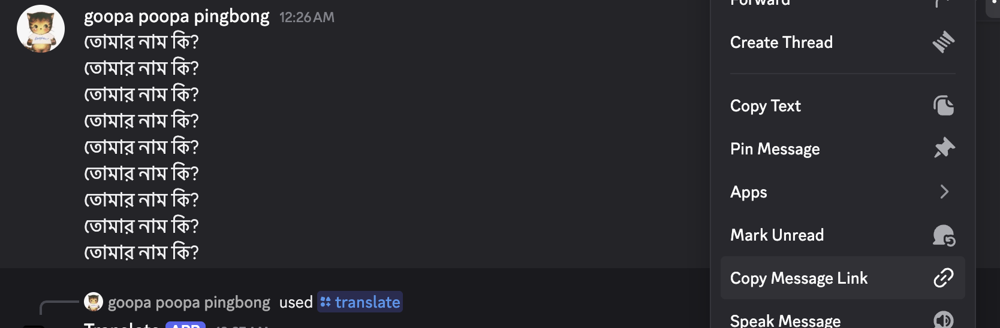
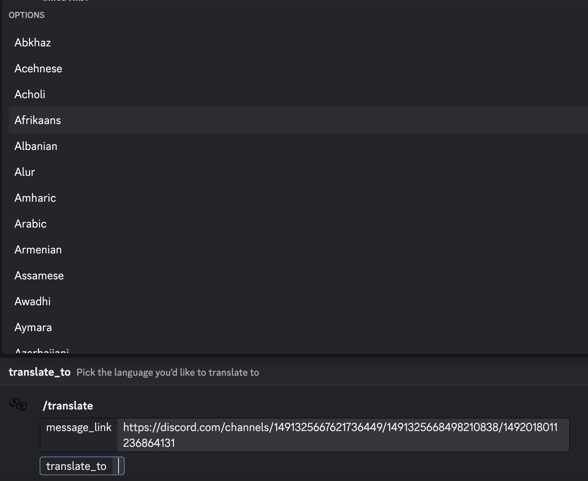
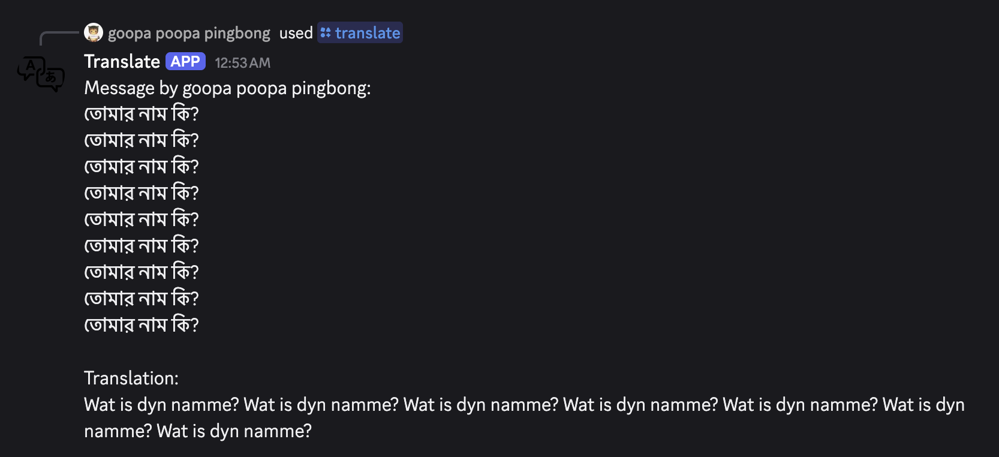

## Discord Translate Bot

Translates messages in a server by running the command `/translate \[message_link (required)\] \[translate_to (optional)\]

Future extensions:
- make the output look a little prettier by using TextDisplayBuiler which lets you do markdown
- have the option to input message ID or the content of the message
- deploy the bot so it runs 24/7

Resources:
- https://discordjs.guide/legacy
- https://docs.cloud.google.com/translate/docs/translate-text#basic_tx + the vast maze of google api docs